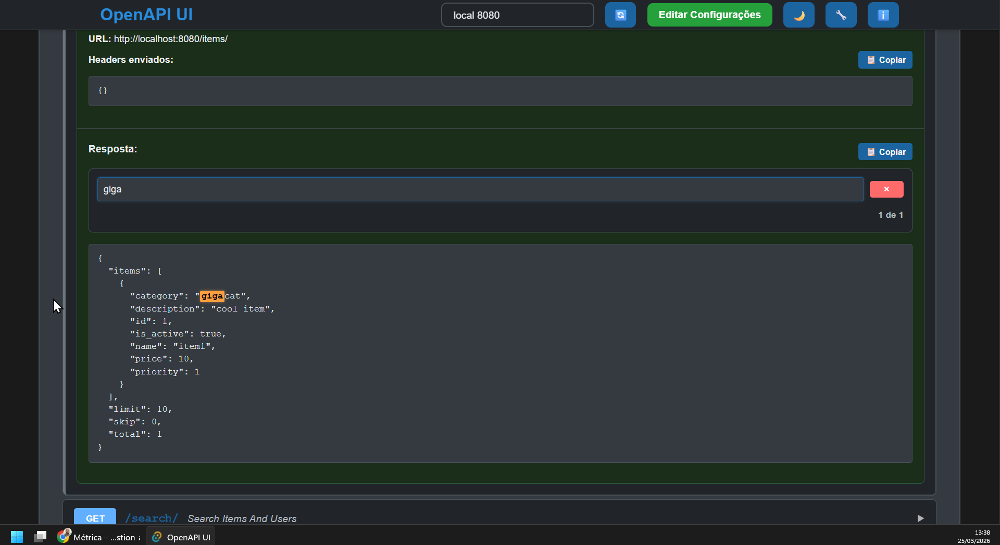
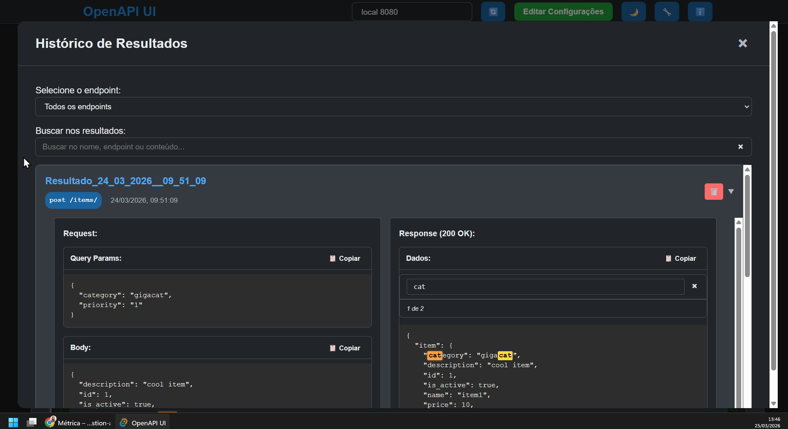

# OpenAPI UI

Uma aplicação desktop para testar e explorar APIs OpenAPI construída com Tauri e TypeScript.

## 🚀 Funcionalidades

### 📋 Gerenciamento de Configurações
- **Múltiplas Configurações**: Adicione e gerencie várias configurações de APIs
- **Autenticação padrão**: Suporte para autenticação gcloud (executa gcloud auth print-identity-token e inclui no header Authorization automaticamente)
- **Interface Intuitiva**: Formulário simples para adicionar/editar configurações de API

### 🔍 Exploração de APIs
- **Carregamento Automático**: Busca automática da especificação OpenAPI (`/openapi.json`)
- **Interface Rica**: Visualização detalhada de todos os endpoints disponíveis
- **Filtros Inteligentes**: Exclui automaticamente endpoints "Root" para melhor visualização
- **Informações Completas**: Exibe título, versão, descrição e URL base da API

### 🧪 Teste de Endpoints
- **Teste Interativo**: Interface completa para testar todos os métodos HTTP
- **Parâmetros Query**: Suporte automático para parâmetros de query com validação
- **Body JSON**: Editor de JSON para métodos POST, PUT, PATCH com exemplos automáticos (se disponíveis no schema)
- **Geração de Exemplos**: Cria exemplos baseados no schema da OpenAPI
- **Respostas Detalhadas**: Exibe status, headers, body enviado e resposta completa

### 💾 Salvamento de Dados
- **Conjuntos de Valores**: Salve e carregue combinações de parâmetros e body
- **Histórico de Testes**: Salve resultados completos dos testes realizados
- **Gerenciamento Completo**: Edite, exclua e organize seus dados salvos
- **Persistência Local**: Todos os dados são salvos localmente usando localStorage

### 🎨 Interface do Usuário
- **Tema Claro/Escuro**: Alternância entre temas claro e escuro
- **Modal de Histórico**: Visualização organizada do histórico de testes

### 🔧 Funcionalidades Técnicas
- **Proxy Tauri**: Evita problemas de CORS usando proxy nativo
- **Autenticação gcloud**: Executa comando gcloud para obter token e inclui no header Authorization automaticamente
- **Tratamento de Erros**: Mensagens detalhadas para diferentes tipos de erro
- **Copiar Resultados**: Botões para copiar headers, body e respostas

### Autenticação: Por que gcloud?
- Se a sua API requer autenticação com Google Cloud com permissão liberada pelo IAM, a autenticação é feita automaticamente usando o gcloud ao utilizar a opção "Usar Autenticação padrão". Se o teste retornar erro 403, verifique se o usuário tem as permissões necessárias (por exemplo, `roles/run.invoker` para Cloud Run).

## 📸 Screenshots

### Configuração da API


### OpenAPI Carregado
O aplicativo carrega a especificação OpenAPI da URL configurada + '/openapi.json'


### Valores de teste salvos
O usuário pode salvar valores de teste para reutilização futura


### Resultado Salvo
O retorno da API também pode ser salvo para visualização posterior


Opção de busca de texto no resultado


### Histórico de Resultados
O usuário pode visualizar o histórico de testes salvos, com filtro de endpoint, e buscar por substring no texto da resposta




## 🛠️ Tecnologias

- **Frontend**: TypeScript, Vite, HTML5, CSS3
- **Backend**: Tauri (Rust)
- **Armazenamento**: app_data_dir (persistido nativamente pelo Tauri) com fallback para localStorage
- **Interface**: HTML5 nativo com CSS custom

## 🎯 Como Usar

### Baixe o executável em releases

1. **Adicionar Configuração**: Clique em "Editar Configurações" e adicione sua API
2. **Selecionar API**: Escolha a configuração no menu superior
3. **Explorar Endpoints**: Visualize todos os endpoints disponíveis
4. **Testar API**: Preencha os parâmetros e clique em "Testar"
5. **Salvar Dados**: Opcionalmente salve conjuntos de valores e resultados para uso futuro
6. **Visualizar Histórico**: Acesse o histórico completo dos testes salvos

## 🗄️ Armazenamento de Dados

O aplicativo utiliza armazenamento nativo do Tauri (app_data_dir) para persistência de dados, com fallback automático para localStorage. Os seguintes dados são armazenados:

### Estrutura de Armazenamento
- **Configurações**: Configurações de APIs (URL, nome, tipo de autenticação)
- **Conjuntos Salvos**: Conjuntos de parâmetros e body salvos por endpoint
- **Resultados**: Histórico completo de testes realizados
- **Tema**: Preferência de tema (claro/escuro)

**Nota**: O app não salva nada por si só, todos os dados são salvos apenas pelo usuário.


### 💾 Persistência
- **Principal**: app_data_dir (diretório de dados do aplicativo no sistema operacional)
- **Fallback**: localStorage (para compatibilidade)
- **Segurança**: Armazenamento local, sem envio para servidores externos
- **Formato**: JSON estruturado via tauri-plugin-store

## 🛡 Segurança

- **Tokens Locais**: Tokens de autenticação são gerenciados localmente
- **Sem Envio de Dados**: Nenhum dado é enviado para servidores externos
- **Armazenamento Seguro**: Dados salvos localmente no dispositivo

## 🖥 Execução local do código

### Pré-requisitos
- Node.js (versão 22 ou superior)
- Rust e Tauri (https://v2.tauri.app/start/prerequisites/)
- Sistema operacional compatível (Windows, macOS, Linux)

### Instalação

```bash
# Clonar o repositório
git clone https://github.com/alanenggb/openapiui.git
cd openapiui

# Instalar dependências
npm install
```

### Desenvolvimento
```bash
# Executar em modo de desenvolvimento
npm run tauri:dev

# Apenas frontend (para desenvolvimento web)
npm run dev
```

### Build para Produção
```bash
# Build da aplicação
npm run build

# Build do executável
npm run tauri build
```

## 🤝 Contribuição

1. Fork o projeto
2. Crie uma branch para sua feature
3. Commit suas mudanças
4. Abra um Pull Request

## 📝 Licença

Este projeto está licenciado sob a Licença MIT - veja o arquivo [LICENSE](LICENSE) para detalhes.
